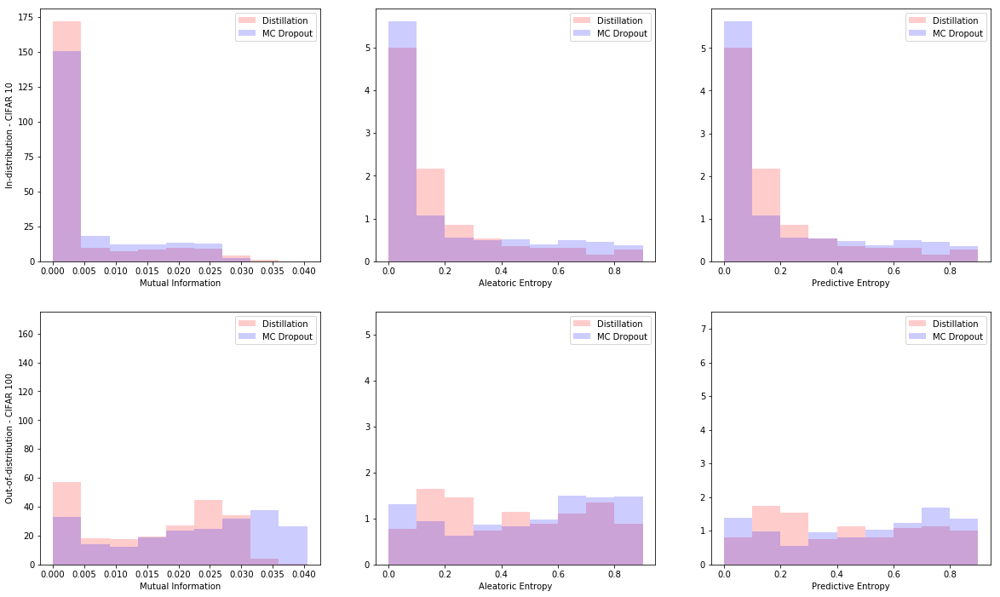

# MC_Dropout_distillation_with_Dirichlet_Distribution

This project attempts to estimate the epistemic uncertainty of a neural network trained by MC-dropout in real-time.
Suppose that we already have a classifier trained with dropout, by turning on the dropout layer at test time, the network gives a distribution of probability vector for each input. This distribution is then used to calculate the so-called epistemic and aleatoric uncertainty.
Since this sampling process (known as MC-dropout) requires about 50~100 samples/input to estimate these two uncertainties, it is not applicable for real-time applications.

One way to approach this problem is to learn the relation between the input and output distribution of that classifier (called it a teacher-network). We train a student network to learn this relationship. The distribution comes from the student network should have a known closed-form such that we can estimate the epistemic uncertainty (by taking the sum of variance of the distribution), predictive uncertainty ( taking the entropy of the mean probability vector) and aleatoric uncertainty (by substracting the predictive uncertainty by the epistemic one). Dirichlet distribution is one of the distribution known for outputing probability vector samples. It is parametrized by the &alpha;i, for i = 0, 1, ..., N where N is the number of classes. This means that the number of output units in the student network is the same as the one in teacher network. However, we do not use the softmax activation function; instead, we will use the softplus function since each &alpha;i must be greater than 0. The loss function is defined as the log likelihood of the generated samples (by teacher model) with respect to the Dirichlet distribution (by the student network). The derivation is very simple (minimizing the KL divergence between the two distributions). If you want to learn more about the details, check this classic distillation paper [Bayesian dark knowledge](http://papers.nips.cc/paper/5965-bayesian-dark-knowledge)

This idea is originated after I read the paper on [ Evidential Deep Learning ](http://papers.nips.cc/paper/7580-evidential-deep-learning-to-quantify-classification-uncertainty). There are several recent works that looks very similar to this project, especially  this by A.Malinin [Ensemble Distribution Distillation](https://arxiv.org/abs/1905.00076). In this project, I only train with in-distribution data, but A.Malinin provides some tricks to train with out-of-distribution data as well.

# Requirements
- Python: 3.7.3
- Tensorflow: 1.13.1
- Tensorflow Probability package.

# Instructions:
- In the same directory, create the two following folders: `cifar10vgg`, `cifar10vgg_distill`
- To train the teacher model with dropout, run: `python3 train_cifarvgg.py`. The script will store the model in `cifar10vgg` folder.
- To train the student model, run: `python3 train_vgg10_distillation.py`. The model will be stored in `cifar10vgg_distill`
- Running the script `run.sh` will train both models.

# Results:
You should get several graphs like this after running the script(s). 

This shows that the student network is able to learn the distribution properly. I calculated the correlation of the two models, and they are 0.6 and 0.4 for in-distribution and out-of-distribution respectively. Not too great but not bad either.

  
